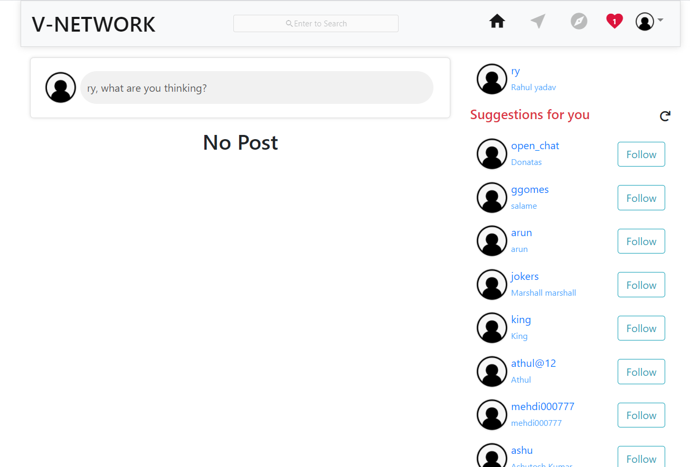
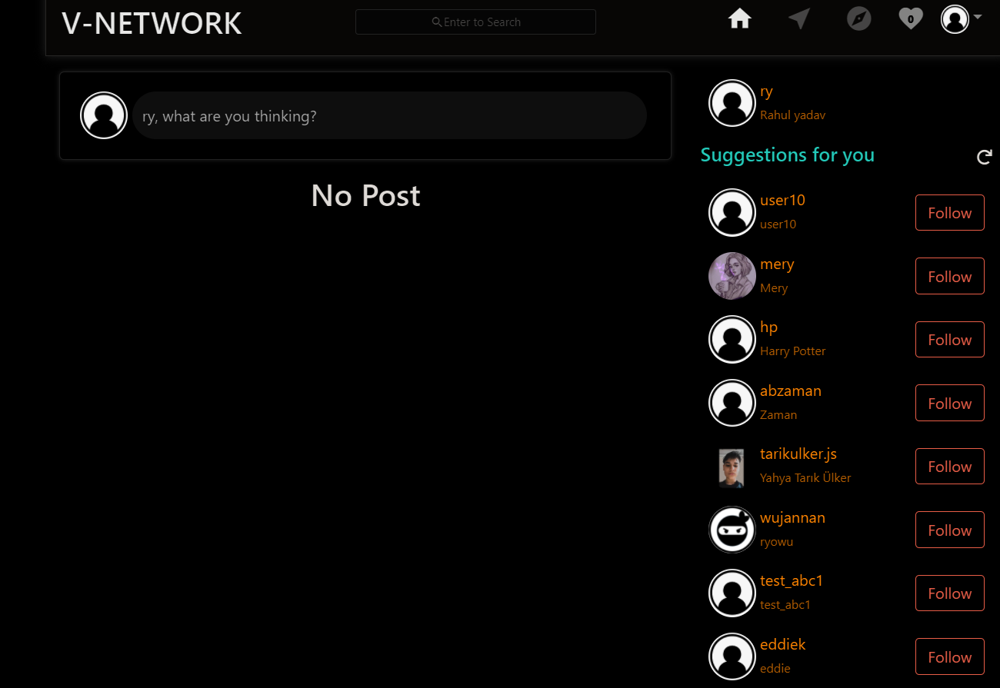
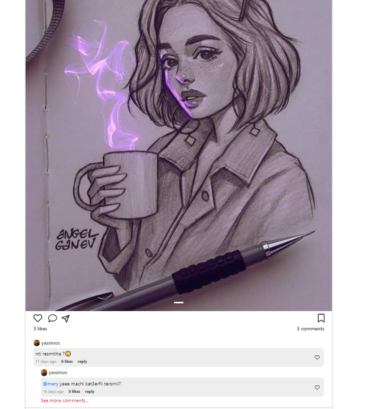
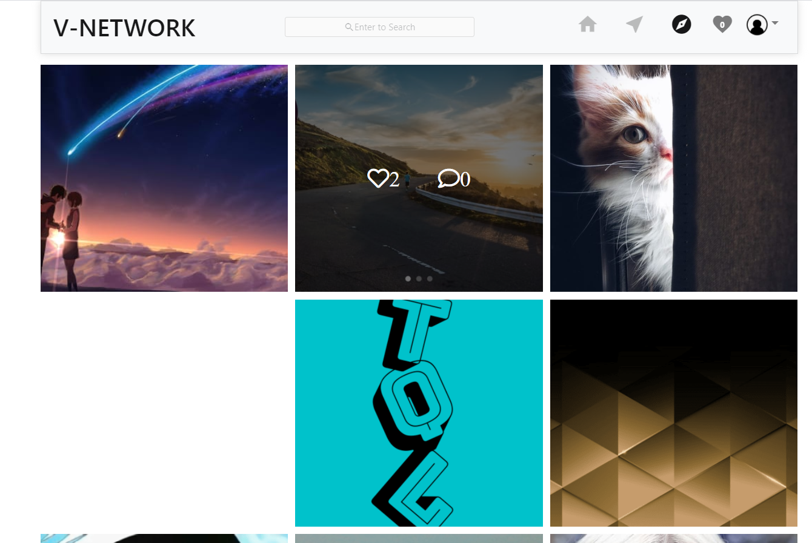
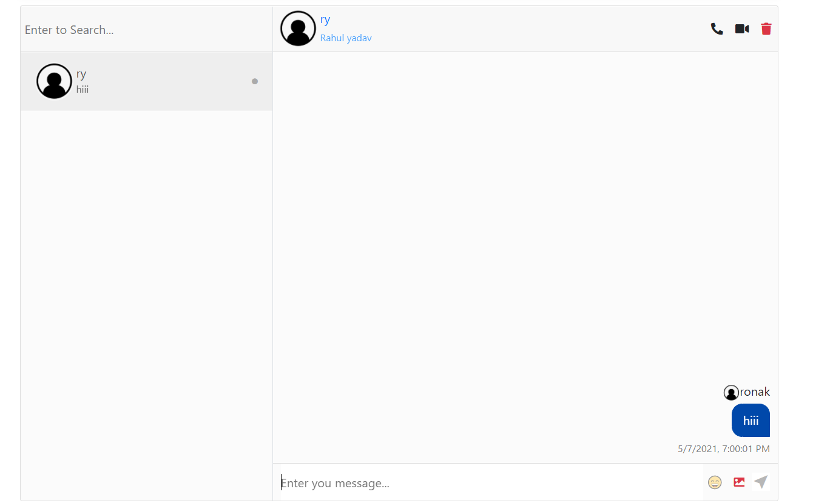
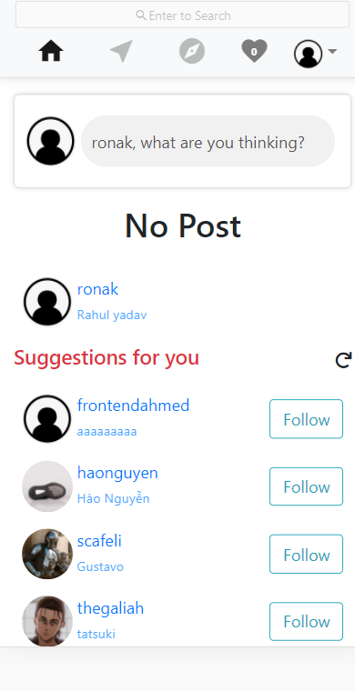

# Instagram-clone
A real time social media application with  all major functionalities of Instagram.
some of the key functionalities are :
* Authentiaction using JWT.
* Single Page Application(SPA).
 * Post photo posts from camera or gallery
   * Like posts
      * View all likes on a post
   * Comment on posts
        * View all comments on a post
 * Search for users
    * Search based on usernames
 * Share the post on watsapp, telegram, reddit, facebook etc.
 * Shave the post .

## Tech Stack
* **Frontend**: React,Bootstrap
* **Backend**: Node.js Express.js
* **Databse**: MongoDB
* **Version Control**: Git and Github

## Demo

